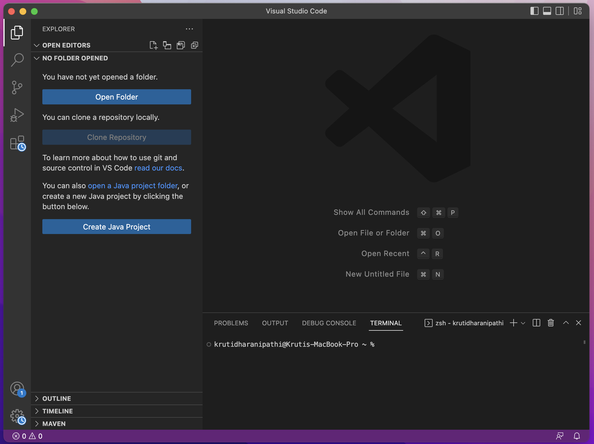
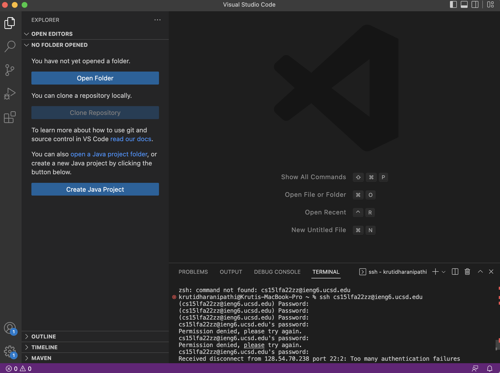
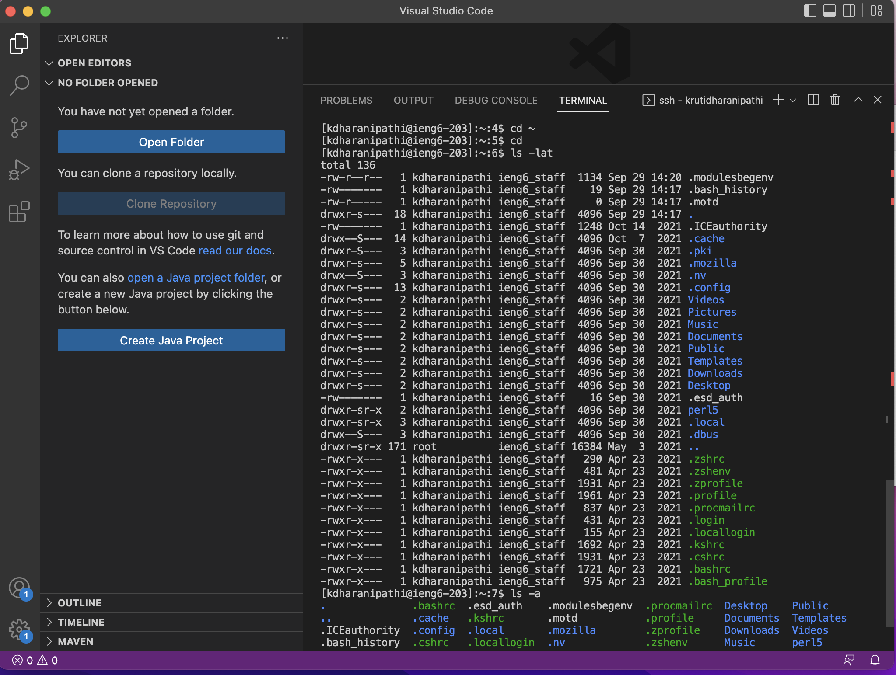
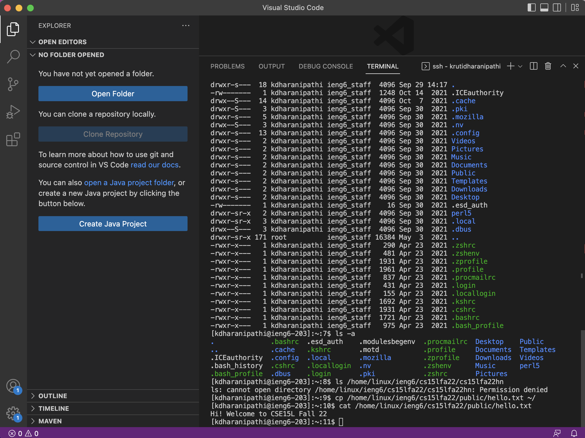
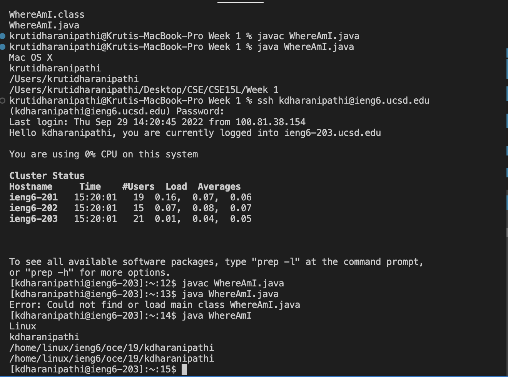
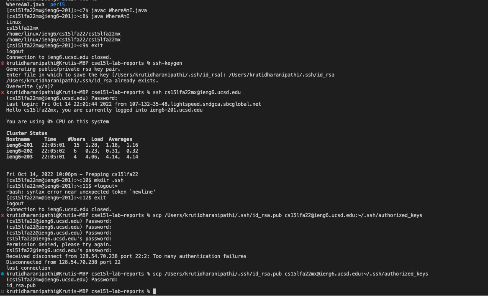
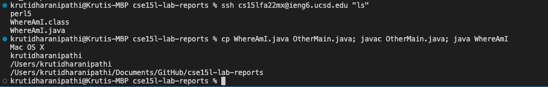

# Lab Report 1

## Step 1: Installing VS Code

The first thing you want to do when do this is go the VS code website and download the app. Be 
sure to pick the right operating system based on the computer you are working on. 

Here is the link to install the software: [VS Code](https://code.visualstudio.com/download)

**Here is what it looks like on Mac after downloading.**




## Step 2: Remotely Connecting

Next we want to log in remotely. To do this we need to log into out CSE specfic account. If you are using Windows you need to install a program call OpenSHH, but since we are working on Mac we will not be installing that account. Next we are going back to VS code to connect the remote computer. 

Here is the link to install OpenSHH: [OpenSHH](https://learn.microsoft.com/en-us/windows-server/administration/openssh/openssh_install_firstuse?tabs=gui)

(Here I have fixed my lab report and added a link to OpenSHH)

We have to first open the terminal and type in our email after shh. This is what it should look like. 

`$ ssh cs15lfa22zz@ieng6.ucsd.edu`  

After doing this it should ask you a yes or no question which you answer "yes" by typing it into the terminal.

It should then ask you for a password which you also type in. This password won't show up when you type it but it's there, don't worry. 

Unfortenly my password didn't end up working so I had to use my ucsd email



When I typed in my password and logged in I saw all of this information while Haosi (lab partner) did not. This was the major difference between our two logins. I’m not exactly sure what the differences mean. Maybe it has something to do with the fact that I used my student account or maybe Haosi has already logged into this account before and this only come up at your first login. (We actually looked into it later but it looks like it didn’t work him because he wasn’t actually able to successfully login and that is why his terminal looks different than mine, his password is still not working). I don't have an image to show this part of the process. 

## Step 3: Trying some Commands

The third step to this would be to try some commands. Here are some commands to try. 

```
- cd ~
- cd
- ls -lat
- ls -a
- ls <directory>
- cp /home/linux/ieng6/cs15lfa22/public/hello.txt ~/
- cat /home/linux/ieng6/cs15lfa22/public/hello.txt
```





 All the commands worked but the only one that didn’t work is the one where I used another students user name. I think it didn’t work because I used my ucsd (kdharanipathi) account because my other account didn’t work with the correct password. 

## Step 4: Moving Files with scp

Now we are working on moving files. This step is pretty important so pay attention. 

First create a WhereAmI.java file.

```
class WhereAmI {
  public static void main(String[] args) {
    System.out.println(System.getProperty("os.name"));
    System.out.println(System.getProperty("user.name"));
    System.out.println(System.getProperty("user.home"));
    System.out.println(System.getProperty("user.dir"));
  }
}
```
Next compile and run the WhereAmI program using the javac and java commands below.

```
javac WhereAmI.java
java WhereAmI
```

Then run the scp command replace with your username. 

Then, log into ieng6 with ssh again, and use ls. You should see the file there in your home directory! Now you can run the program on the ieng6 computer using the same javac and java commands from before.



Something that I noticed was that on my mac when I did java WhereAmI.java it worked but it didn’t work that way when I did it remotely on Linux. On Linux it only worked when I did java WhereAmI. Get property means getting the property at which the item we are looking for is found. 

## Step 5: Setting an SSH Key

Our solution to not have to always copy and paste is SHH keygen. 

Run this out your computer `ssh-keygen`


(I have edited my previous shh-keygen and have now fixed it so I scp the key-gen I created in my local to my remote computer. )

By the end of this you should be able to ssh or scp from this client to the server without entering your password.


## Step 6: Optimizing Remote Running
(I have fixed this part of my lab report by writing more information and including a screenshot as well)

You can now finally making a local edit to WhereAmI.java, then copying it to the remote server and running it.

Do you want to make you life even eaisier. You can also write a command in quotes at the end of an ssh command to directly run it on the remote server, then exit.

You can see me do it below with "ls".

You can also use a semicolon to seperate commands allowing you to run multiple commands on the same line. That's just too good at this point. In my screenshot below you can see me do both.



Now you are finally done! YAY!!


