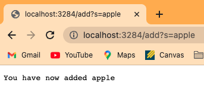
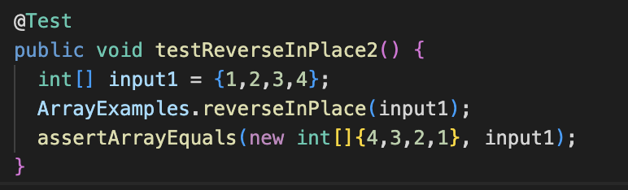
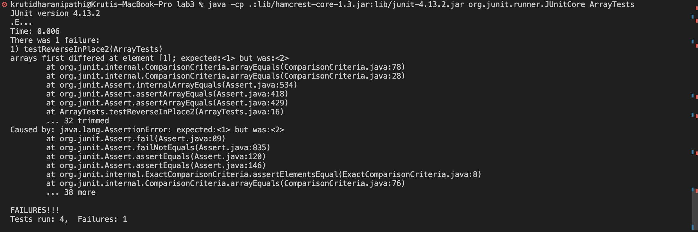
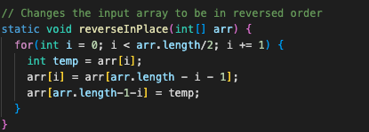
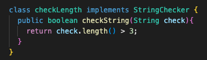
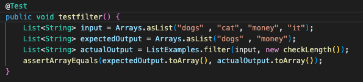
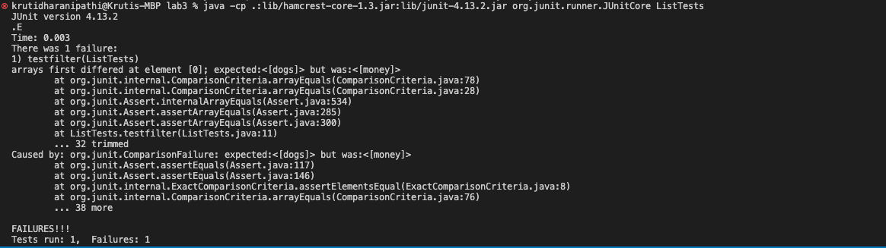
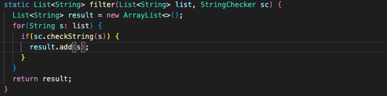

# Lab Report 2

## Search Engine

```
import java.io.IOException;
import java.net.URI;
import java.util.ArrayList;


class Handler implements URLHandler {
    // The one bit of state on the server: a number that will be manipulated by
    // various requests.
    int num = 0;
    ArrayList<String> allStrings = new ArrayList<String>();

    public String handleRequest(URI url) {
        String error = "404 Not Found!";

        if (url.getPath().equals("/")) {

            return String.format("Welcome to my Search Engine. Please Type!");

        } else if (url.getPath().contains("/add")) {
            String[] parameters = url.getQuery().split("=");
            if (parameters[0].equals("s")) {
                allStrings.add(parameters[1]);
                return String.format("You have now added " + parameters[1]);
            }
            else{
                return error;
            }
    
        } else if (url.getPath().contains("/search")){
            String[] parameters = url.getQuery().split("=");
            String foundItems = "";
            if (parameters[0].equals("s")) {
                for ( int i = 0; i < allStrings.size(); i++){
                    if (allStrings.get(i).contains(parameters[1])){
                        foundItems = foundItems + allStrings.get(i) + "\n";
                    }
                }
                return String.format("I have found " + foundItems);
            }
            else{
                return error;
            }
        }
        return error;
    }
}


class SearchEngine {
    public static void main(String[] args) throws IOException {
        if(args.length == 0){
            System.out.println("Missing port number! Try any number between 1024 to 49151");
            return;
        }

        int port = Integer.parseInt(args[0]);

        Server.start(port, new Handler());
    }
}
```


**Welcome Page**


This called the welcome page. The code below shows where it was called

```
if (url.getPath().equals("/")) {

            return String.format("Welcome to my Search Engine. Please Type!");
```
This one has no paramters it is checking. If the path eqauls "/" then it will just return the statement from above. 

**Adding String**



This added apple to our data of the string that were searched. The code below shows the method.

```
else if (url.getPath().contains("/add")) {
            String[] parameters = url.getQuery().split("=");
            if (parameters[0].equals("s")) {
                allStrings.add(parameters[1]);
                return String.format("You have now added " + parameters[1]);
            }
            else{
                return error;
            }
```
For add, when it sees that it contains "/add" it then splits it into an array of strings at "=". It then checks if the first string in the array at index 0 is "s", and if it is, it will add the next index of the array into the ArrayList that keeps track of all the strings being added. For example, in this instance, the parameters array is {"s" , "apple"}. We can see that "s" is in index 0 and "apple" is in index 1. We then add what is in index one (apple) to allStrings. If a different word, such as pineapple, was being added, then the parameters would look like
{"s" , "pineapple"} instead. Then pineapple would be in index 1 and would be added to allStrings. It then returns the output saying what we have now added.


**Find SubString**


```
else if (url.getPath().contains("/search")){
            String[] parameters = url.getQuery().split("=");
            String foundItems = "";
            if (parameters[0].equals("s")) {
                for ( int i = 0; i < allStrings.size(); i++){
                    if (allStrings.get(i).contains(parameters[1])){
                        foundItems = foundItems + allStrings.get(i) + "\n";
                    }
                }
                return String.format("I have found " + foundItems);
            }
```
For search, it first searches and checks if that path contains "/search" and if it does, then it continues on with the rest of the code. Then like with add, it creates an array of strings called parameters and splits at "=". We also create a new empty string called foundItems, where we will add all the items we find containing the substring we are searching for. With search, the second parameter at index 1 is the substring we are searching for. So in this situtaiton the paramters would be {"s" , "app"}. We will then search through the ArrayList of all the strings that have been added, looking to see if any of them contain parameters index 1 (which is app). When we find something that contains "app" it is then added to foundItems, which will then at the end be returned showing all the strings that contain app. If we wanted to search for something else, we would change what is after the equal sign. This would lead to a new parameters for example 
{"s", "pine"}. 


## Array

**The failure-inducing input** 

There was a failure with ReverseInPlace so I created a test to check if it was working properly and this is the test that I wrote.



I found that the test failed and the method was infact not working properly.

**Symptom** 

The ouptut was wrong at index 1. It should hace been 1 but instead it was 2. Here was what Junit showed as the error.



**Bug** 

I then fixed the code so that it would reverse the code in place the right way.



**Why**

The reason the code didn't work the first time and caused an error is because whenever it switching the values the original value that was in the index would have already been replaced so it was switching with the already switched values and that lead to an incorrect array. I fixed this in my new code by creating a temp varible thet stores it so it doesn't go away forvere when we are reversing the array. 

## List

**The failure-inducing input** 

There was a failure with filter so I created a test to check if it was working properly. Before writing the test I made a class that implements StringChecker so I have some condition that filter will check for. I made it so it checks if the length of the string is greater than 3 and return true if it is. Here is the class and test I wrote.




I found that the test failed and filter was infact not working properly.

**Symptom** 

The output didn't match because it showed up in the wrong order. Money was were dogs should be and vise versa. Here was what Junit showed as the error.



**Bug** 

I then fixed the code so that it would return it in the right order.



**Why**

The reason the code didn't work the first time and caused an error is because it keeps adding to elemts to the front of list and that would return the opposite of the expected output because it would be returning in the order reverse that it should return in. It would give us the right elements in the ouptut but they would be be in the worng order. In my example you can see money and dogs were returned but they weren't in the right order. I fixed this by changing the add to be at the end instead of the front.