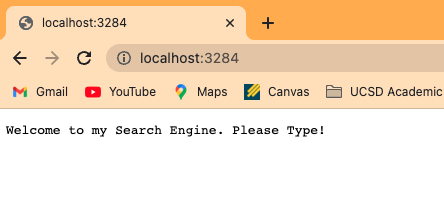

# Lab Report 2

## Search Engine


```
import java.io.IOException;
import java.net.URI;
import java.util.ArrayList;


class Handler implements URLHandler {
    // The one bit of state on the server: a number that will be manipulated by
    // various requests.
    int num = 0;
    ArrayList<String> allStrings = new ArrayList<String>();

    public String handleRequest(URI url) {
        String error = "404 Not Found!";

        if (url.getPath().equals("/")) {

            return String.format("Welcome to my Search Engine. Please Type!");

        } else if (url.getPath().contains("/add")) {
            String[] parameters = url.getQuery().split("=");
            if (parameters[0].equals("s")) {
                allStrings.add(parameters[1]);
                return String.format("You have now added " + parameters[1]);
            }
            else{
                return error;
            }
    
        } else if (url.getPath().contains("/search")){
            String[] parameters = url.getQuery().split("=");
            String foundItems = "";
            if (parameters[0].equals("s")) {
                for ( int i = 0; i < allStrings.size(); i++){
                    if (allStrings.get(i).contains(parameters[1])){
                        foundItems = foundItems + allStrings.get(i) + "\n";
                    }
                }
                return String.format("I have found " + foundItems);
            }
            else{
                return error;
            }
        }
        return error;
    }
}


class SearchEngine {
    public static void main(String[] args) throws IOException {
        if(args.length == 0){
            System.out.println("Missing port number! Try any number between 1024 to 49151");
            return;
        }

        int port = Integer.parseInt(args[0]);

        Server.start(port, new Handler());
    }
}
```


**Welcome Page**




This called the welcome page. The code below shows where it was called

```
if (url.getPath().equals("/")) {

            return String.format("Welcome to my Search Engine. Please Type!");
```


This added apple to our data of the string that were searched. The code below shows the method.

```
if (url.getPath().equals("/")) {

            return String.format("Welcome to my Search Engine. Please Type!");
```


