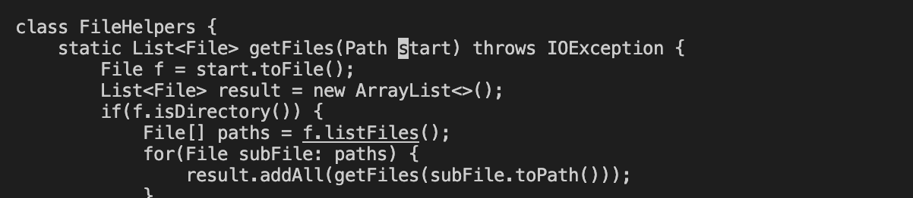

# Week 7 Lab Report

## Part 1

I choose to do the option where I changed the name of the start parameter and its uses of base. I thought a good idea would be to use the search find and replace to change them from start to base. You first have to do `vim DocSearchServer.java` to enter vim on the DocSearchServer.java file.

```
/ s t a r t <Enter> c e b a s e <Esc> n . n . : w q <Enter>
```

I first typed in vim DocSearchServer.java to the terminal and this is what showed up.


I then typed in \start which found the first time the word start appears in the code.


When I pressed enter after typing in \start it the terminal it jumped the cursor to start on the first letter which is se


I then did ce which selected the whole word deleted it (to replace) and entered insert mode


In insert mode I then typed in base as the word to replace start and then pressed `<Esc>` to exit out of inset mode.


I then did n which took me to the start of next time the word start appears in the code. 


By pressing . after the n I was able to replace the word start with base. I then did it again to replace the third occurrence of the word start.


I then do :wq  to exit out of vim and save the code.

## Part 2

It took me **33 seconds** doing it using the first method without vim and **47 seconds** doing it with vim. I had decided to so exaclty what I did in part 1 of this lab but instead changing it back from base to start. I didn't really have any problems using scp and the whole process ran very smoothly especailly because I had access to the scp and ssh statements already and I just had to paste. This means that there were no typos or anything slowing down because of typing. It was a bit more difficult with vim in my opnion because I am still now used to the commands. It was faster making the edits when using the find and replace in vim but it was still a bit of struggle because I wasn't used to it.


**Which of these two styles would you prefer using if you had to work on a program that you were running remotely, and why?**

I prefer using the scp but I think that is only because I am used to it more. I think if I had more practice with vim and was able to do vim commands without having to think about them I would prefer to use vim instead.

**What about the project or task might factor into your decision one way or another? (If nothing would affect your decision, say so and why!)**

I think something that would factor in would be how difficult that changes are. It it invovles something that I haven't experienced yet in vim I would just scp. If it was something that I have practice with on vim I would try to use vim and would be more open to it.