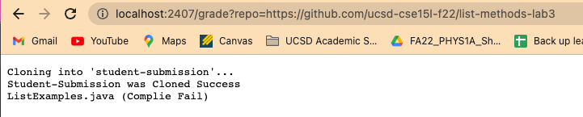

# Week 9 Lab Report

```

set -e

CPATH="student-submission/ListExamples.java"
JUNITPATH=".:../lib/hamcrest-core-1.3.jar:../lib/junit-4.13.2.jar"

rm -rf student-submission
git clone $1 student-submission

if [[ ! -f $CPATH ]]
then
    echo "ListExamples.java not found"
    exit
else 
    echo "Student-Submission was Cloned Success"
fi

set +e 

cp TestListExamples.java student-submission
cd student-submission

javac -cp $JUNIT_PATH *.java 2> juniterr.txt

if [[ $? -eq 0 ]]
then
    echo "ListExamples.java (Complie Success)"
else
    echo "ListExamples.java (Complie Fail)"
    exit
fi

java -cp $JUNIT_PATH org.junit.runner.JUnitCore TestListExamples 2> junitout.txt

if [[ $? -ne 0 ]]
then
    echo "Tests Failed"
    FAILURE=$(grep "Failures: " junitout.txt)
    SCORE=$((5-$FAILURE))
    echo $SCORE "/5"
else
    echo "All tests passed!"
    echo "Score: 5/5"
fi
```





Let's take a look at the first screenshot. I first set it to -e which makes it so whenever there is an error the script will immedaitly exit. In grade.sh first clones the code from the URL. If cloning was sucessful which in this case it was, it will print out `Student-Submission was Cloned Success`. In this line the standard error would be `ListExamples.java not found` and the standard output would be the output that we got of `Student-Submission was Cloned Success`. In this if statement the condition is true which leads to the correct output. We then move onto the next part where I do `cp TestListExamples.java student-submission` to copy TestListExamples.java to student-submission directory and then `cd student-submission` to change directories. It will them compile the code and checks to see if it actually compiles. The standard output would be `ListExamples.java (Complie Success)` but unforunletly it seems that this students code doesn't fully work because they got a comiler errors with and out saying `ListExamples.java (Complie Fail)`. The return code was non-zero so it script now exits. This if statement wasn't true. The last if statement in the code never runs because of the fact that the code fails to complie causes us to exit the script before that statement can run.